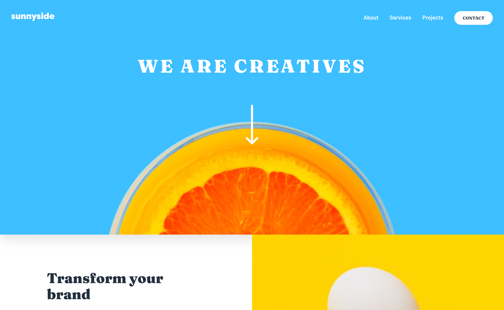

# Frontend Mentor - Sunnyside agency landing page solution

This is a solution to the [Sunnyside agency landing page challenge on Frontend Mentor](https://www.frontendmentor.io/challenges/sunnyside-agency-landing-page-7yVs3B6ef). Frontend Mentor challenges help you improve your coding skills by building realistic projects.

## Table of contents

- [Overview](#overview)
  - [The challenge](#the-challenge)
  - [Screenshot](#screenshot)
  - [Links](#links)
- [My process](#my-process)
  - [Built with](#built-with)
  - [What I learned](#what-i-learned)
  - [Continued development](#continued-development)
  - [Useful resources](#useful-resources)
- [Author](#author)
- [Acknowledgments](#acknowledgments)


## Overview

### The challenge

Users should be able to:

- View the optimal layout for the site depending on their device's screen size
- See hover states for all interactive elements on the page

### Screenshot




### Links

- Solution URL: [Add solution URL here](https://your-solution-url.com)
- Live Site URL: [Add live site URL here](https://your-live-site-url.com)

## My process

### Built with

- Semantic HTML5 markup
- CSS custom properties
- Flexbox
- CSS Grid
- Mobile-first workflow
- Vanilla JavaScript

### What I learned

While building this project, I practiced structuring a **multi-section landing page** using semantic HTML, CSS Grid/Flexbox layouts, and a mobile-first approach. I also improved at managing **design tokens with CSS variables** and handling **responsive typography and spacing**.

Here’s a small code snippet I’m proud of:

```css
:root {
  /* Colors */
  --red-400: hsl(7, 99%, 70%);
  --yellow-500: hsl(51, 100%, 49%);
  --green-800: hsl(167, 40%, 24%);
  --blue-800: hsl(198, 62%, 26%);
  --green-500: hsl(167, 34%, 41%);
  --gray-950: hsl(212, 27%, 19%);
  --gray-600: hsl(213, 9%, 39%);
  --gray-550: hsl(232, 10%, 55%);
  --gray-400: hsl(210, 4%, 67%);
  --white: hsl(0, 100%, 100%);

  /* Typography */
  --ff-sans: "Barlow", sans-serif;
  --ff-serif: "Fraunces", serif;
  --fs-100: 0.875rem;
  --fs-200: 1rem;
  --fs-300: clamp(1.125rem, 1.1rem + 0.3vw, 1.25rem);
  --fs-500: clamp(1.5rem, 1.2rem + 1.5vw, 2rem);
  --fs-600: clamp(2rem, 1.4rem + 2.5vw, 2.5rem);
  --fs-700: clamp(2.25rem, 1.2rem + 4vw, 3.25rem);
  --lh-tight: 1.15;
  --lh-base: 1.6;

  /* Spacing */
  --space-2: 0.5rem;
  --space-3: 0.75rem;
  --space-4: 1rem;
  --space-6: 1.5rem;
  --space-8: 2rem;
  --space-10: 2.5rem;
  --space-12: 3rem;
  --space-16: 4rem;

  /* Layout */
  --container-max: 90rem;
  --radius-lg: 2rem;
  --shadow-md: 0 15px 30px rgba(0, 0, 0, 0.1);

  /* Z-index */
  --z-header: 10;
}
```

### Continued development

In future projects, I’d like to focus more on:

- Enhancing accessibility (ARIA roles, focus states, etc.)

- Adding subtle animations for smoother user experience

- Improving my workflow for larger landing pages with more sections

### Useful resources

[CSS Tricks - A Complete Guide to Grid](https://css-tricks.com/snippets/css/complete-guide-grid/) – Helped me with advanced grid layouts.

[MDN Web Docs](https://developer.mozilla.org/) – My go-to reference for HTML, CSS, and JavaScript.

## Author

- Github - [@BirukL137](https://github.com/BirukL137)
- Frontend Mentor - [@BirukL137](https://www.frontendmentor.io/profile/BirukL137)

## Acknowledgments

Thanks to the Frontend Mentor community for feedback and support 🙌
